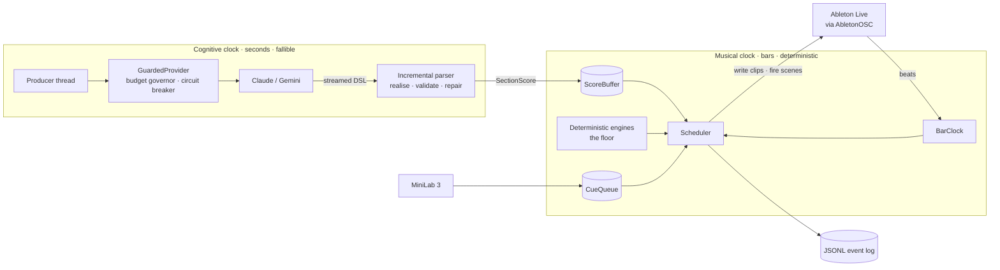

# GARAGEM

**A rock band that composes while it plays.** GARAGEM writes a four-piece arrangement
(drums, bass, guitar and keys) section by section and performs it live in Ableton Live. A
language model writes the grooves, and deterministic engines write the song around them. A
musician conducts the band from a MIDI controller. When the network fails, the band keeps
playing.

[](https://github.com/fbattaglin/garagem-music/actions/workflows/ci.yml)


---

## Contents

- [What it does](#what-it-does)
- [How it works](#how-it-works)
- [Design invariants](#design-invariants)
- [Getting started](#getting-started)
- [Conducting from the MiniLab 3](#conducting-from-the-minilab-3)
- [Development](#development)
- [Project layout](#project-layout)
- [Status and roadmap](#status-and-roadmap)
- [Documentation](#documentation)

## What it does

- **Generates music live.** Each section of a song is written just before it is needed and
  launched on the bar by Live's own transport, through
  [AbletonOSC](https://github.com/ideoforms/AbletonOSC).
- **Splits the work by strength.** A frontier model (Anthropic Claude; a Google Gemini
  adapter is included) writes each section's groove in a compact text notation. Deterministic
  engines compose the form: arrangement, builds, stops, fills and the final chord.
- **Never falls silent.** Every model call has a local, seeded counterpart, called the
  *floor*. A late answer, a dropped connection or an open circuit breaker changes who wrote
  the next section, never whether it plays.
- **Takes direction from a human.** Pads on an Arturia MiniLab 3 cue the band on the next bar,
  and knobs shape the energy and tension of the sections still to come.
- **Measures itself.** Every decision, fallback, cue and write goes into a JSONL event log
  with its beat and its seed. Any performance can be audited and replayed.

**Measured, not assumed** (`docs/architecture/phase-4-findings.md`):

| | |
|---|---|
| An 8-minute conducted performance | 489 s continuous, 0 beats lost, 34 of 34 cues on the next bar, $0.24 |
| Chaos test: Wi-Fi lost twice mid-song | 0 beats lost, and nothing audible to the listener |
| Model output, recorded regression set | 29 of 29 sections conformant, none needing repair |
| Test suite | 2,093 tests, network-free by construction, `mypy --strict` clean |

## How it works

GARAGEM runs on two clocks that never call each other. Live owns the musical clock, which
must not jitter. Python and the model API own the cognitive clock, which takes seconds and
sometimes fails. A data structure, the `ScoreBuffer`, is the only thing that crosses between
them.



1. **Plan.** A song form is arranged from a seed, as a sequence of sections, each with a key,
   feel, tempo, dynamics and tension. It lives in a shared, versioned `FormPlan`.
2. **Ask ahead.** The producer thread briefs the model on the next section it can still serve,
   with a strict tool schema and a deadline taken from the section's length. The response is
   parsed as it streams, realised into notes, checked by a music-theory validator and
   repaired. Only then is it offered to the buffer.
3. **Write ahead.** During the first bar of section *N*, the scheduler writes section *N+1*
   into a scene that is not playing. It uses the model's score if one is ready and the
   floor's otherwise, and logs which with its seed.
4. **Let Live keep time.** The scheduler fires the next scene a bar early, and Live's
   launch quantisation performs the switch on the downbeat. No clip that is playing is ever
   rewritten.
5. **Conduct.** A pad strike only fires material that was written before it could be needed
   ([ADR-022](docs/architecture/ADR-022-a-cue-costs-a-fire-never-a-write.md)). A cue costs
   a fire, never a write, which is why it lands on the next bar. After a jump the form is
   re-planned deterministically, and the model is asked again about the new song.

## Design invariants

These are non-negotiable, and most are enforced by tests rather than by convention.

1. **Two clocks.** The musical and cognitive clocks are separated by a data structure, never
   by a function call. An architecture test forbids the real-time packages from importing the
   LLM layer.
2. **The system plays without a network.** Every path that uses a model has a local
   deterministic counterpart. An API failure degrades the music; it never silences it.
3. **No network, allocation or JSON on the real-time path.**
4. **Never trust model output.** A strict schema, then a deterministic musical validator.
5. **Never retry on the critical path.** A retry is a planning decision, not an execution
   one.
6. **Timing is Live's problem.** Clips are written into the next scene, and launch
   quantisation switches them. A playing clip is never rewritten.
7. **Every generation is deterministic given a seed,** and every seed is logged.

## Getting started

### Requirements

| | |
|---|---|
| Python | 3.12, managed with [uv](https://docs.astral.sh/uv/) |
| Ableton Live | 12 (Lite is enough: 4 of its 8 tracks and 8 scenes are used), with AbletonOSC |
| Operating system | macOS for performances, since Live and CoreMIDI run there. The test suite runs anywhere Python does. |
| Optional | An Arturia MiniLab 3 to conduct, and an Anthropic API key to generate |

### Install and verify

```bash
uv sync
cp .env.example .env    # ANTHROPIC_API_KEY; GEMINI_API_KEY only for the Google adapter
uv run pytest           # no network, no Live, no money
```

### Connect Ableton Live

```bash
uv run python scripts/install_abletonosc.py    # installs the Remote Script
```

1. In Live's preferences, choose **AbletonOSC** as a Control Surface, then quit and reopen
   Live.
2. Open a Set with four MIDI tracks and an instrument on each, laid out as
   [`session.toml`](session.toml) describes.
3. Validate the Set, and let the bootstrap repair what can be repaired safely: tempo, launch
   quantisation, track names and arm state. It never creates a track.

```bash
uv run python scripts/bootstrap_set.py --apply
uv run python scripts/probe_live.py            # read-only walk of every OSC address used
```

### Play

```bash
uv run python scripts/jam.py --dry-run                       # print the song's form; touch nothing
uv run python scripts/jam.py --seconds 180 --seed 7          # the deterministic band, no network
uv run python scripts/jam.py --generate --seconds 480        # the model writes the grooves
uv run python scripts/jam.py --generate --controller minilab # ...and you conduct
```

A generated performance is bounded by the budget governor, set in
[`config/budget.toml`](config/budget.toml).
- **Expected cost** of an 8-minute performance: $0.30.
- **Caps:** the governor stops calling the model at $1.00 a session or $0.50 a minute, and
  the floor plays on.

After a generated run, `jam.py` prints a report of every exit criterion, read from the event
log.

## Conducting from the MiniLab 3

The mapping lives in [`controller.toml`](controller.toml). Every MIDI number in it was read
from the hardware by `scripts/probe_minilab.py`, not taken from a manual.

| Control | What the band does | When |
|---|---|---|
| Pad 1: stop | hits the downbeat and cuts, then the drummer picks the song back up | next bar |
| Pad 2: fill | the drummer runs down the toms | next bar |
| Pad 3: drums and bass | guitar and keys drop out until the section ends | next bar |
| Pad 5: chorus now | the band cuts to the chorus | next bar |
| Pad 6: next, bridge | the next section becomes a bridge | next section that can still change |
| Pad 8: end | the song finishes through an outro and a final chord | next section that can still change |
| Knob 1: density | sparser grooves to the left, busier to the right | sections not yet written |
| Knob 2: tension | harder fills, walking bass and more lift to the right | sections not yet written |

## Development

| Command | Purpose |
|---|---|
| `uv run pytest` | Unit, property, golden and regression tests. Never touches the network. |
| `uv run pytest -m live` | Integration tests against a running Live with AbletonOSC |
| `uv run ruff check --fix . && uv run ruff format .` | Lint and format |
| `uv run mypy` | Strict type checking over `src`, `tests` and `scripts` |
| `uv run python scripts/rehearse_session.py` | Play an 8-minute conducted session offline and predict its cost |
| `uv run python scripts/record_regression.py` | Record the model regression set. Paid; estimates and stops unless `--yes` |
| `uv run python scripts/bench_latency.py` | Measure p50/p95/p99 time to first token per model. Paid; `--yes` |
| `uv run python scripts/probe_minilab.py` | List what the MiniLab 3 sends, control by control |

**How the tests stay honest:**

- **The network is fused.** `tests/conftest.py` blocks `connect` and `sendto` for every test
  not marked `live`, so a test that reaches the wire fails instead of spending money.
- **Model calls are cassettes.** Recorded streams in `cassettes/` are replayed with their
  request fingerprints checked. A changed prompt fails CI until it is recorded again.
- **Musical regression.** `tests/regression/` replays a recorded set of 29 sections through
  the full parse, realise, validate and repair path. It compares each result against golden
  files and against the conformance and approval targets. Model drift shows up as a diff.
- **Property tests** (Hypothesis, derandomised) cover the theory, DSL and transition
  invariants.
- **Architecture tests** enforce the layering:
  - the pure layers do no I/O, use no global randomness and import no infrastructure;
  - the transport never reaches the network, and only the producer may.

CI runs lint, formatting, types and the full suite on every push to `main`
([`.github/workflows/ci.yml`](.github/workflows/ci.yml)). It holds no API keys.

## Project layout

```
src/garagem/
├── domain/      pure musical model: notes, bars, charts, sections, cues. No I/O
├── theory/      scales, voicings, coherence metrics, validator, repairer. No I/O
├── dsl/         the notation: incremental stream parser, serialiser, tool schemas
├── engines/     deterministic generators: arranger, grooves, bass, guitar, keys, endings
├── agents/      the producer thread, section briefs, routing
├── llm/         LLMProvider port, Anthropic and Google adapters, governor, circuit breaker, cassettes
├── daw/         DawPort, the AbletonOSC adapter, a fake Live, Set-as-Code validation
├── transport/   BarClock, ScoreBuffer, CueQueue, FormPlan, the clip-ahead scheduler
├── control/     ControllerPort, the MiniLab 3 adapter (mido), a fake controller
├── setlist/     online pre-production, offline playback
└── obs/         JSONL event log, metrics, performance report
scripts/         performance, probes, benchmarks, recording and listening tests
tests/           unit · property · golden · regression · integration (live)
config/          model catalogue and prices; per-session budget
docs/            architecture baseline, ADRs, phase findings, status
bench/           event logs and measurements the findings cite
cassettes/       recorded model streams, replayed by the tests
session.toml     "Set as Code": the Live Set the bootstrap validates against
controller.toml  "Controller as Code": which pad and knob asks the band for what
```

## Status and roadmap

The project advances through gated phases. A phase closes only when every exit criterion has
evidence, or when a criterion is explicitly waived in an ADR with its threshold intact.

| Phase | Scope | Status |
|---|---|---|
| 0 | Foundation, instrumentation, fuses | Closed |
| 1 | The bridge to Ableton Live | Closed · 2026-08-30 |
| 2 | Clock, buffer and deterministic engine | Closed · 2026-08-30 |
| 3 | First structural generation, one call per section | Closed · 2026-09-01 · one waiver ([ADR-018](docs/architecture/ADR-018-the-ab-waiver.md)) |
| 4 | The full band and the tactical layer, conducted from the MiniLab | Closed · 2026-09-13 · one waiver ([ADR-023](docs/architecture/ADR-023-the-second-ab-waiver.md)) |
| 5 | When the model is worth calling; Setlist Mode for offline shows; voice control | **Current** |
| 6 | Timbre, mixing and an offline asset bakery | Planned |

**One finding shapes what comes next.** In the last three blind listening tests, 36 pairs in
all, sections written by the model and by the deterministic floor were preferred equally, 18 to
18. The
floor is an instrument in its own right, not a fallback. Phase 5 therefore starts by asking
where the model earns its latency, cost and failure modes. The current phase and its evidence
are tracked in [`docs/architecture/STATUS.md`](docs/architecture/STATUS.md).

## Documentation

- [`ADR-000-baseline.md`](docs/architecture/ADR-000-baseline.md): the architecture,
  principles and roadmap
- [`docs/architecture/README.md`](docs/architecture/README.md): an index of every
  Architecture Decision Record
- `phase-0-findings.md` … `phase-4-findings.md`: what the measurements and integrations
  actually showed, as opposed to what the baseline assumed
- [`CLAUDE.md`](CLAUDE.md): working conventions for AI-assisted development in this
  repository

## License

Copyright © 2026. All rights reserved. This is a private repository, and no licence is
granted to use, copy, modify or distribute its contents.
